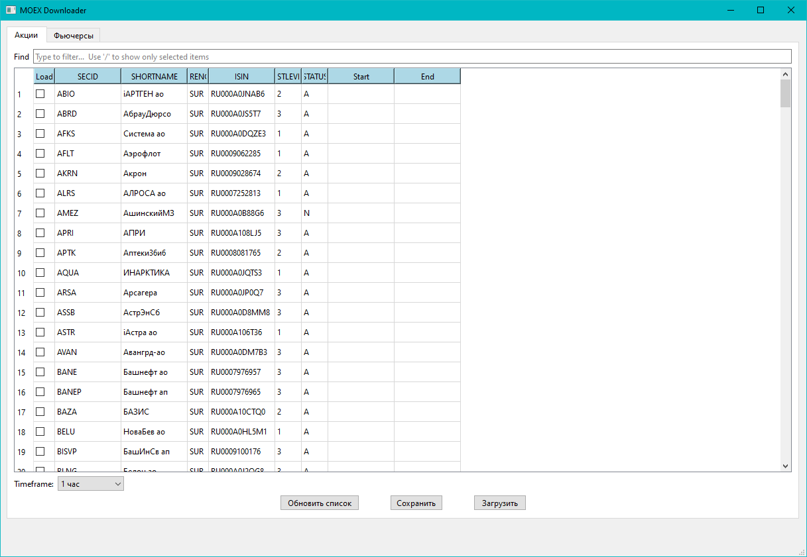

# MOEX Downloader

Приложение для загрузки данных свечей (candles) с Московской биржи (MOEX) с использованием графического интерфейса PyQt6.



## Требования

- Python 3.12 или выше
- UV (менеджер пакетов Python)

## Установка и запуск

### 1. Установка UV

[UV](https://docs.astral.sh/uv/) — это современный и быстрый менеджер пакетов Python. Установите его одним из способов:

#### На Windows (PowerShell):
```powershell
powershell -ExecutionPolicy ByPass -c "irm https://astral.sh/uv/install.ps1 | iex"
```

#### На macOS/Linux:
```bash
curl -LsSf https://astral.sh/uv/install.sh | sh
```

Или через pip (если UV уже установлен):
```bash
pip install uv
```

Проверьте установку:
```powershell
uv --version
```

### 2. Навигация в проект и запуск приложения

```powershell
uv run moex_downloader.py
```

UV автоматически создаст виртуальное окружение и установит все зависимости из `pyproject.toml`:
- `httpx-moex` — для работы с API MOEX
- `pandas` — для работы с данными
- `pyqt6` — для графического интерфейса
- `qasync` — для асинхронного программирования в PyQt6

## Использование приложения

1. **"Обновить список"** — обновляет данные для выбранного тикера
2. **Сохранить** — сохраняет конфигурацию таблицы в CSV файл
3. **Загрузить** — загружает данные свечей (candles) для выбранных инструментов

#####  Приложение поддерживает два типа инструментов:
- **Stocks** (акции)
- **Futures** (фьючерсы)

#####  Параметры дат:
- **Start** — начальная дата, с которой приложение будет скачивать свечные данные.
- **End** — конечная дата. Если поле пустое, данные будут скачаны до последнего доступного момента.
 
  Формат дат: **YYYY-MM-DD**

##### Обновление данных при повторном запуске:

Если вы повторно запускаете скачивание с теми же параметрами:
- и End не заполнен, то приложение не перекачивает весь диапазон заново;
- приложение докачивает только новые свечные данные и добавляет их в конец файла.

Это удобно, чтобы поддерживать базу истории в актуальном состоянии без лишних операций.

##### Формат сохраняемых данных:
Данные сохраняются в CSV-файлах в формате:
```csv
Datetime;Open;High;Low;Close;Volume
2015-01-05 10:00:00;11.15;11.95;11.15;11.45;840600
```
Каждый CSV файл автоматически сжимается в ZIP и сохраняется как, например:  `AFKS_M30.csv.zip`

##### Преимущества такого подхода:
- данные занимают гораздо меньше места на диске;
- Pandas отлично читает ZIP-архивы напрямую, без предварительной распаковки

## Структура проекта

```
moex_downloader/
├── moex_downloader.py      # Основной файл приложения
├── pyproject.toml          # Конфигурация проекта и зависимости
├── README.md               # Этот файл
├── stocks_config.csv       # Конфигурация акций (создаётся при запуске)
├── futures_config.csv      # Конфигурация фьючерсов (создаётся при запуске)
└── DATA/                   # Директория для сохранения данных
```

## Решение проблем

### ModuleNotFoundError: No module named 'httpx_moex'

Убедитесь, что вы запустили `uv sync` в директории проекта.

### Окружение не активируется

Если вы используете PowerShell и получаете ошибку выполнения скриптов, выполните:
```powershell
Set-ExecutionPolicy -ExecutionPolicy RemoteSigned -Scope CurrentUser
```

### UV не найден

Убедитесь, что UV установлен и добавлен в PATH, переустановите если необходимо.

## Зависимости

Все зависимости автоматически устанавливаются при запуске `uv sync`. Список зависимостей:

- **httpx-moex** (>=0.1.0) — API клиент для MOEX
- **pandas** (>=2.0.0) — обработка данных
- **pyqt6** (>=6.8.0) — графический интерфейс
- **qasync** (>=0.27.0) — асинхронное программирование для PyQt6


